- Qu'est-ce qu'un astre? 
- Comment, quand et où observer: site, vêtements, lampe rouge

---

#### Comment s'orienter: Points cardinaux

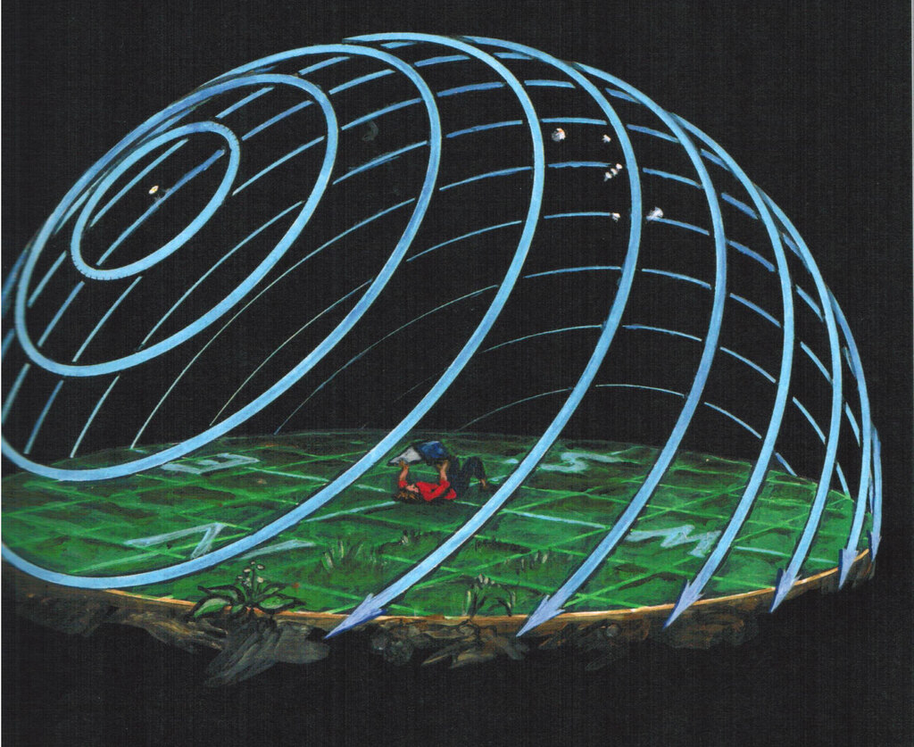

---

#### Instruments

- Œil nu, jumelles, télescopes

---

#### Qu'est-ce qu'une constellation?

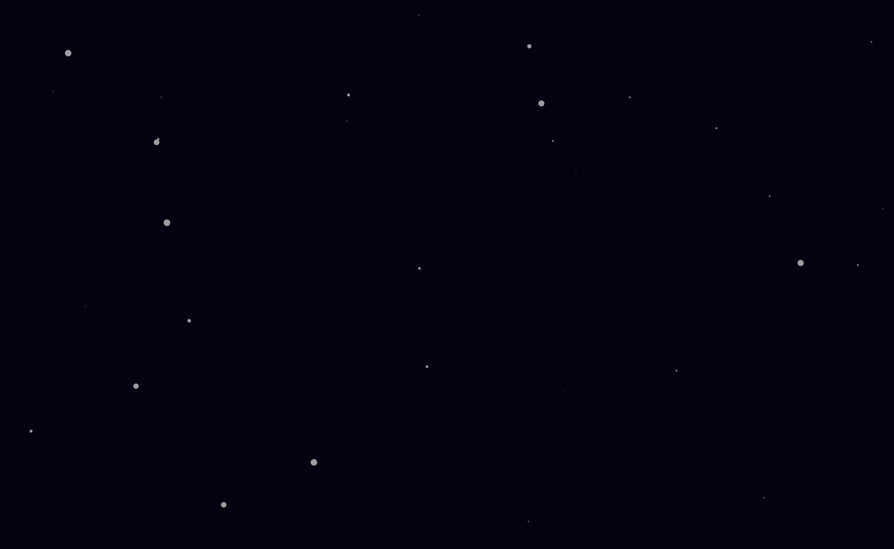

---

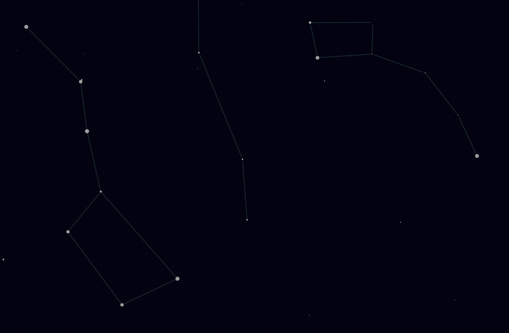

---

#### La Grande Ourse!

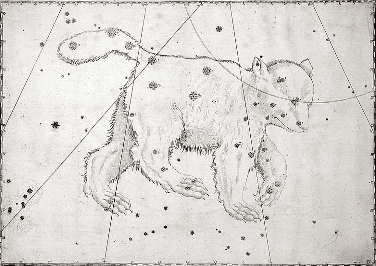

---

#### Cartes du ciel

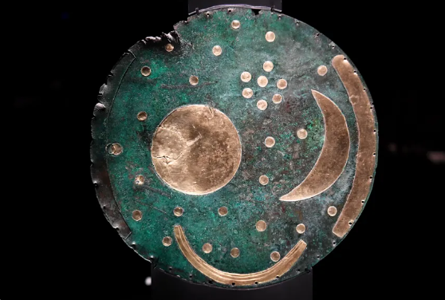

---

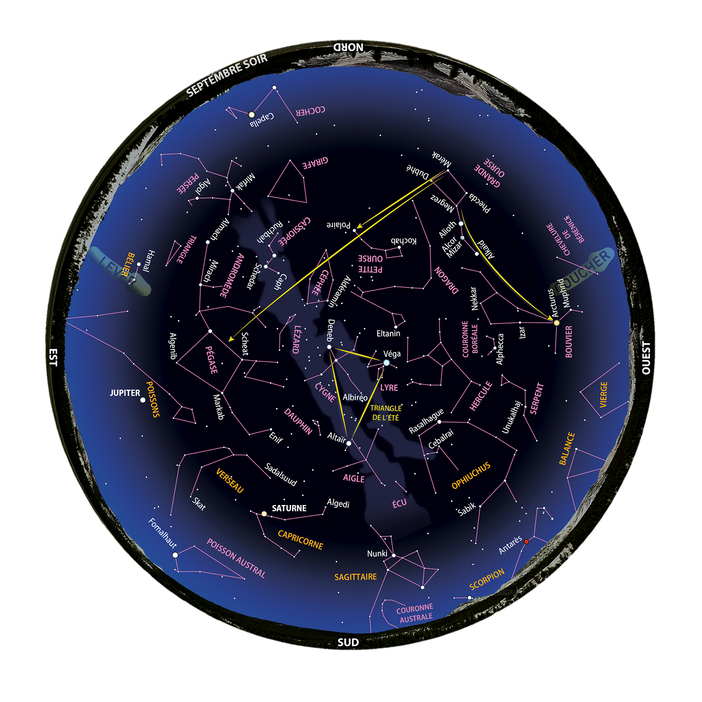

---

#### Le Zodiaque

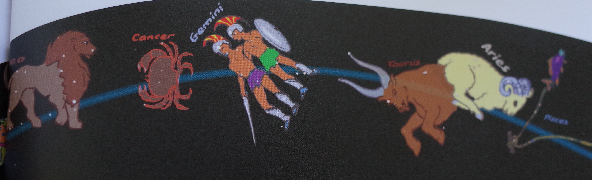

---

#### Le Système Solaire

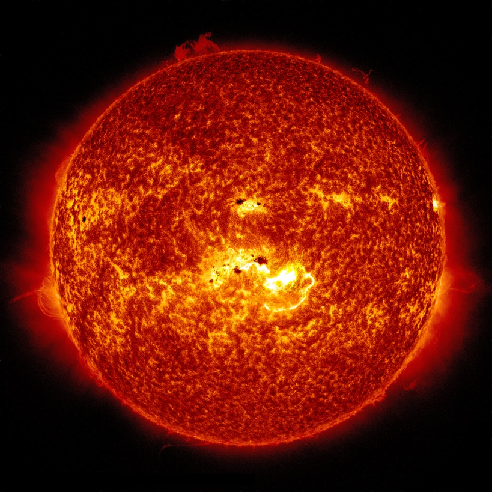

---

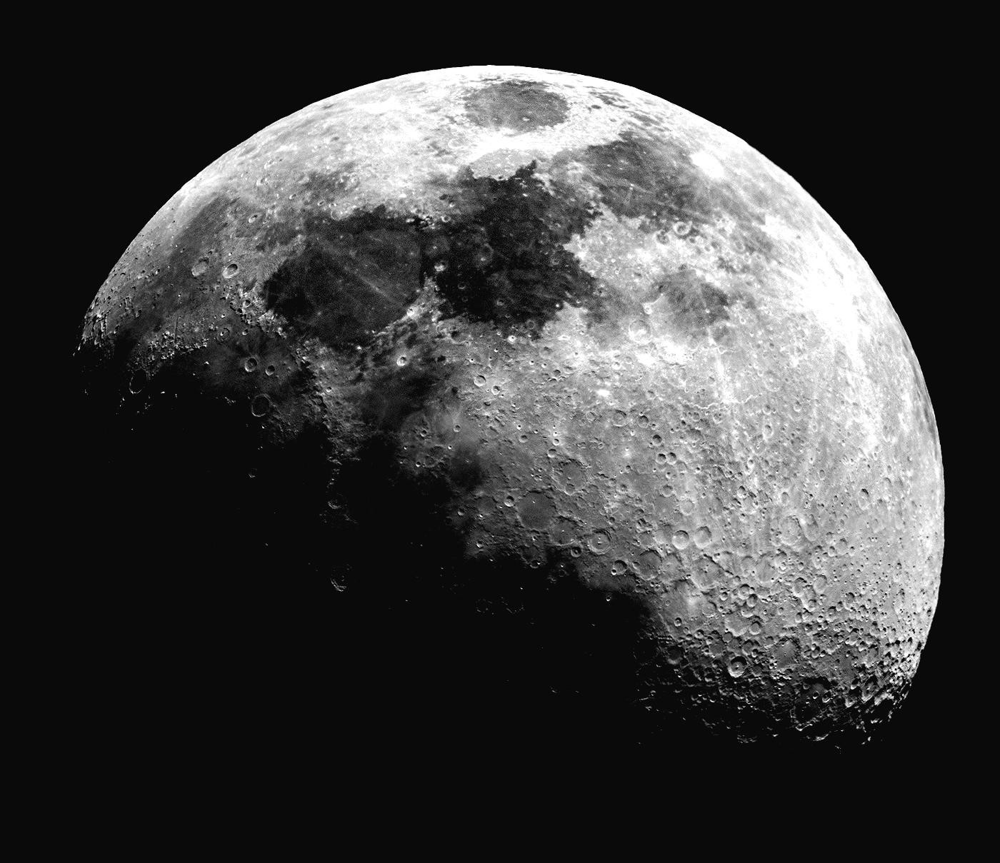

---

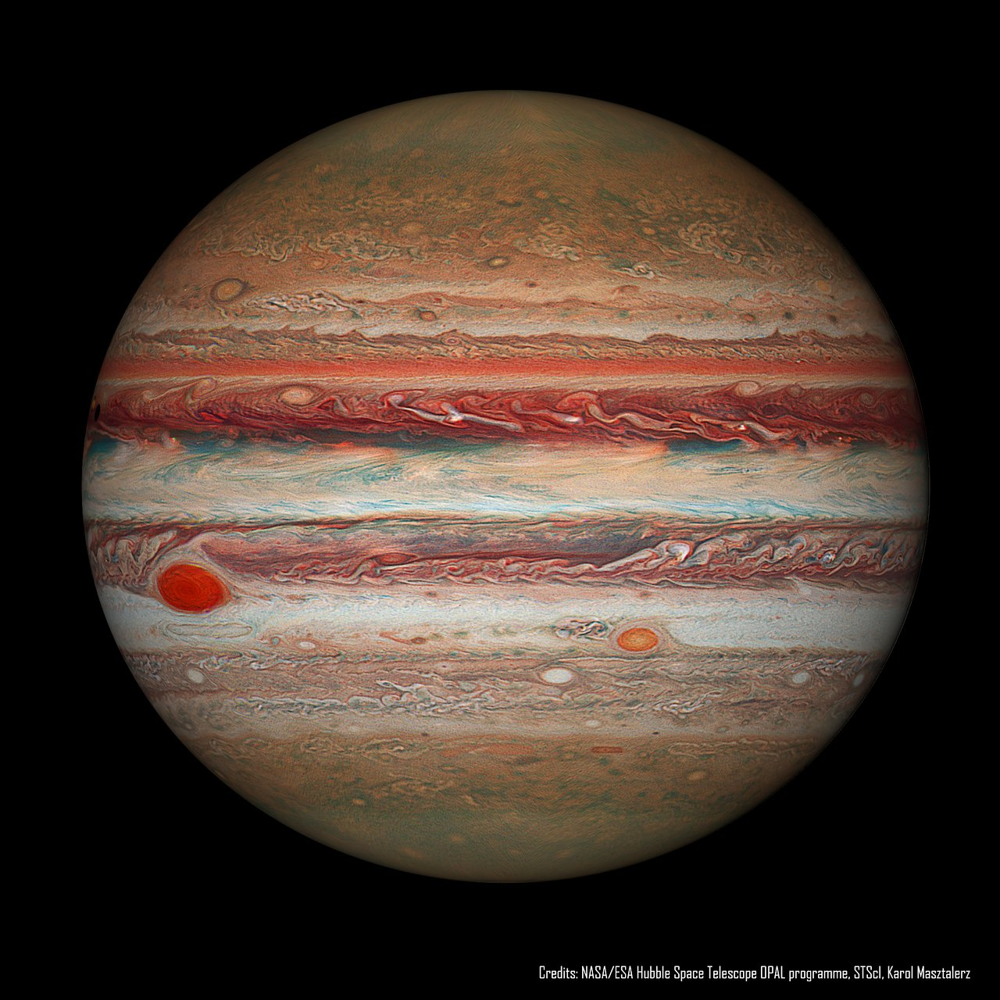

---

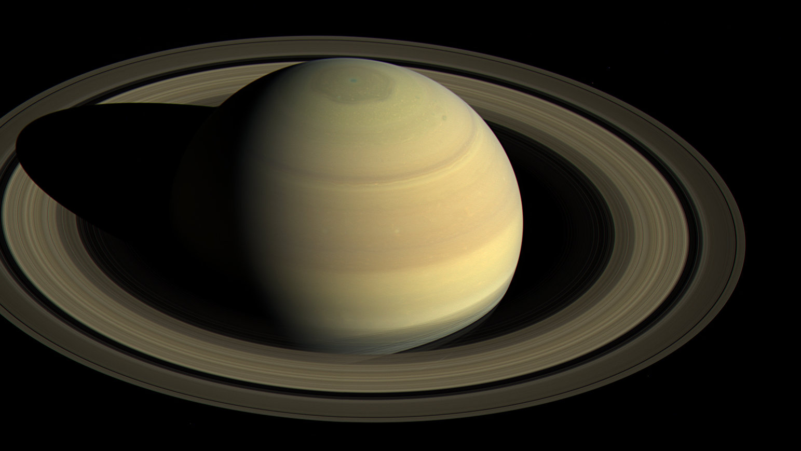

---

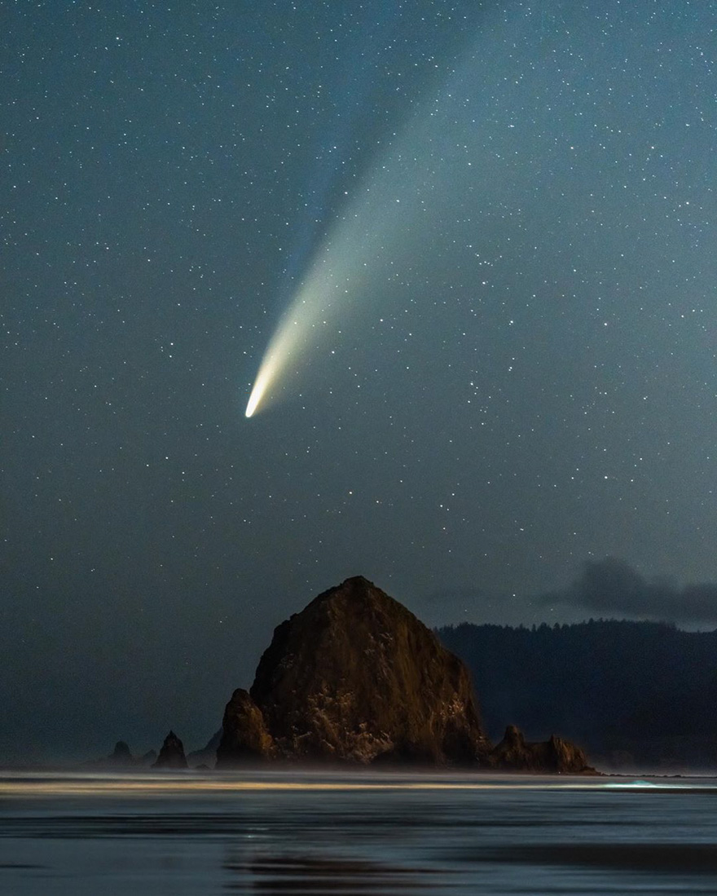

---

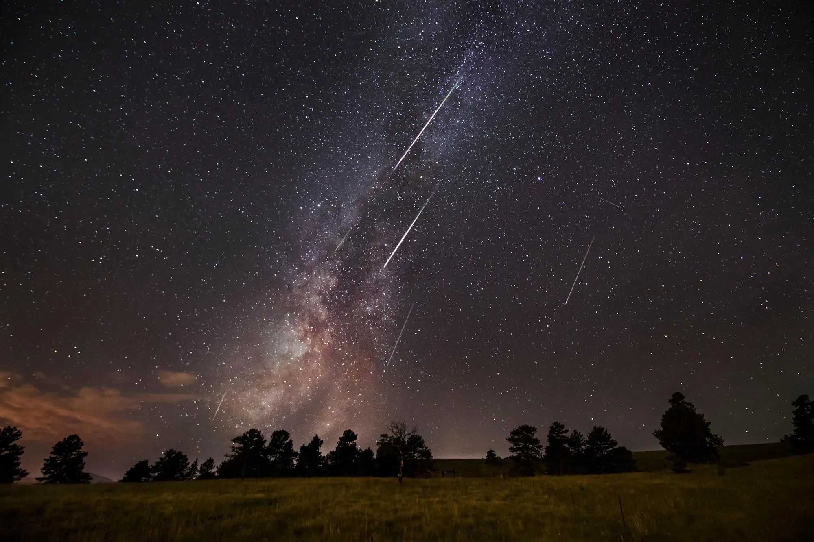

---

#### Au-delà du Système Solaire

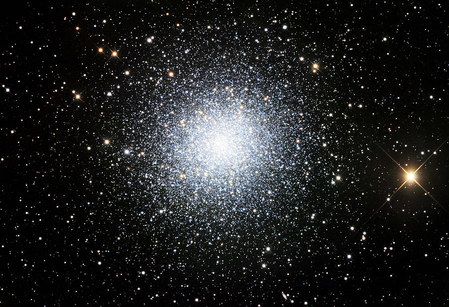

---

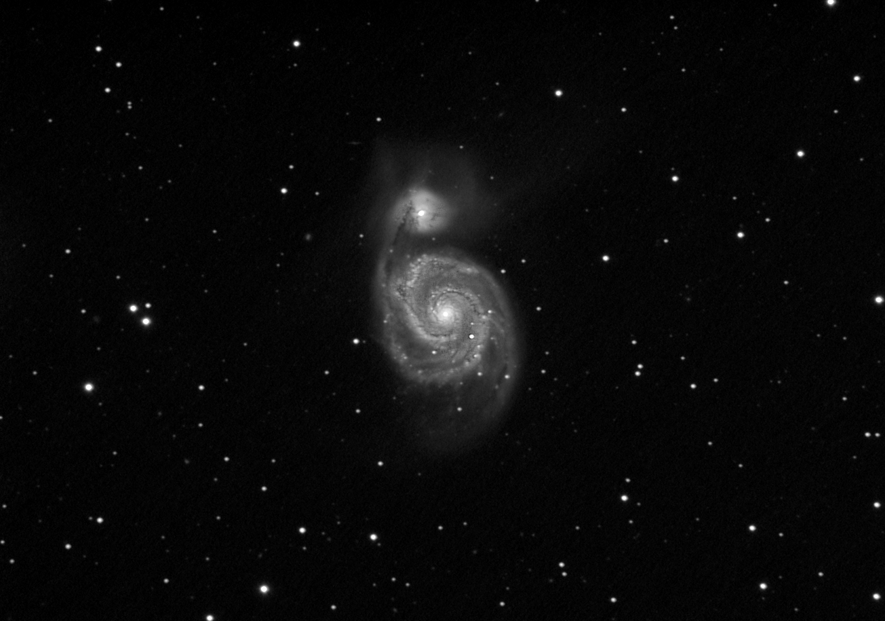

---

#### Pourquoi observer le ciel?
