Adapté de "Crash Course Astronomy" (Phil Plait)

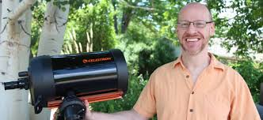
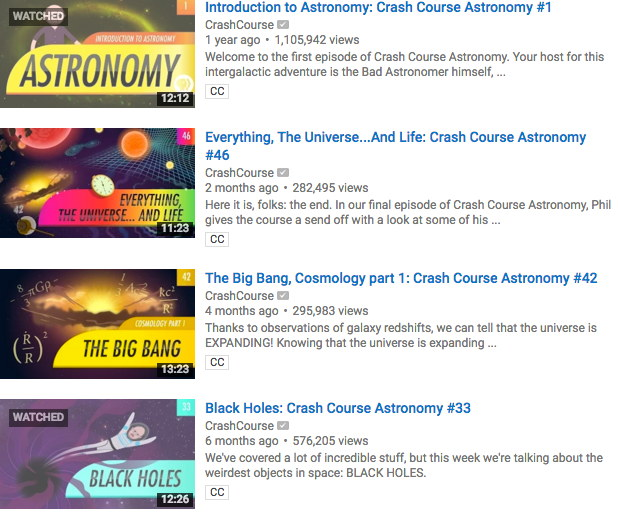

---

# La Lumière

Presque toute l’information sur l’Univers vient sous la forme de lumière. Comment est-elle créée?

La lumière peut être décrite comme une onde, qui représente la variation de champs électrique et magnétique.\

La distance entre vagues est la **longueur d’onde**, qui varie comme l'inverse de la fréquence (c =  λf)

**L’énergie** de la lumière augmente avec la fréquence

---

## Newton: 1643-1727

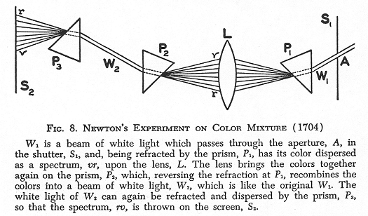

----

## Maxwell: 1831-1879

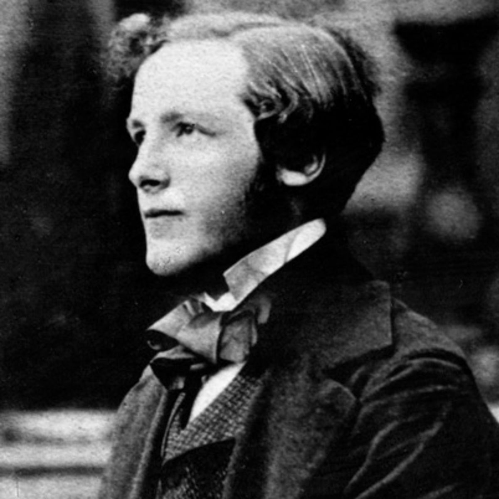

---

## Le spectre électromagnétique

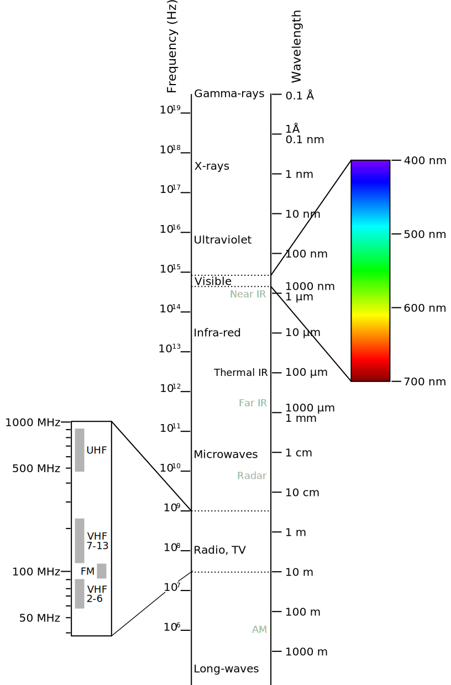

---

## La spectroscopie

Newton

Fraunhofer

Kirchhoff  et Bunsen
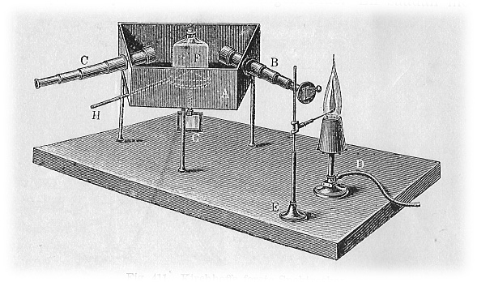

<figure>
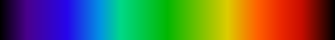
<figcaption>spectre continu</figcaption>
</figure>

<figure>

<figcaption>spectre d'absorption</figcaption>
</figure>

<figure>

<figcaption>spectre d'émission</figcaption>
</figure>

----

## Le spectre continu

Quand on chauffe un objet, il perd son énergie en émettant de la lumière, dont le type dépend de la température: plus l’objet est chaud, plus la longueur d’onde est courte.

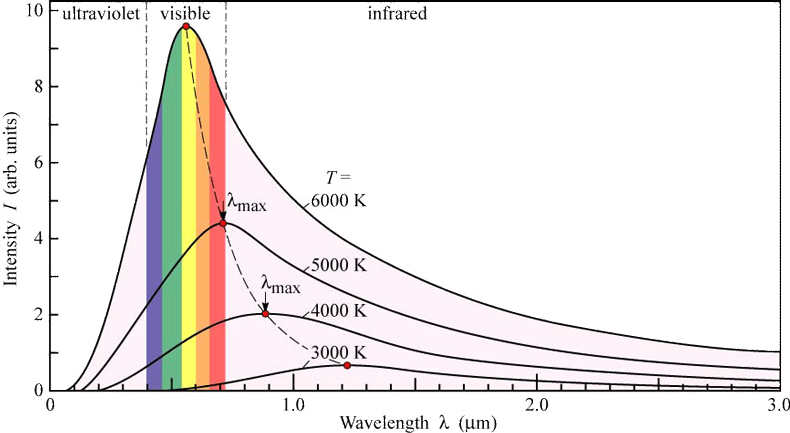

Dans le langage des astronomes, “plus bleu” veut dire “longueur d’onde plus courte” et “plus rouge” veut dire “longueur d’onde plus longue”.

----

## Spectres d'émission et d'absorption

Les électrons dans les atomes ne peuvent occuper que des espaces bien définis autour du noyau, qui dépendent de l’énergie des électrons, comme les marches d’un escalier.\

Quand on leur **donne** de l’énergie sous forme de lumière, ils montent d’une marche, et cette lumière est ré-émise quand ils **perdent** la même énergie.

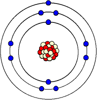
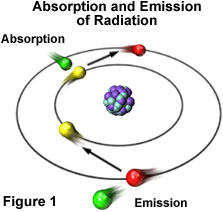

---

Quand un électron saute vers le haut ou vers le bas, il absorbe ou émet une énergie (couleur) spécifique, qui caractérise l’atome: l’hydrogène a un spectre différent de l’hélium, de l’oxygène, etc.

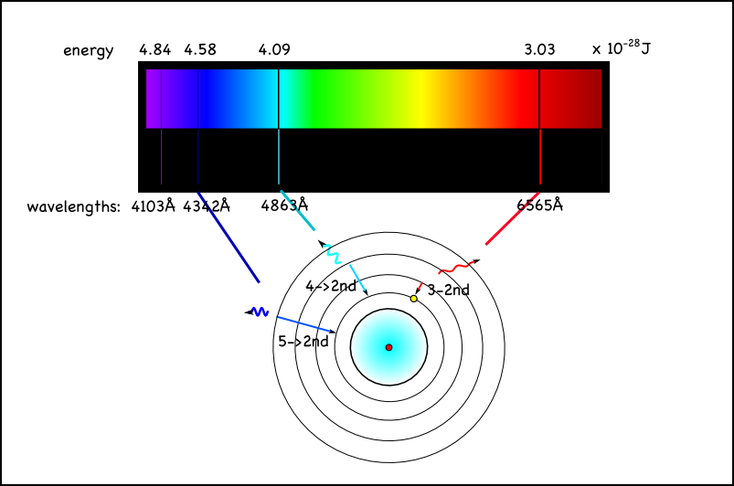

----

L'analyse du spectre est la **clé** de la compréhension de l’Univers: Si on peut mesurer la lumière, on peut déterminer de quoi l’objet est fait, même s’il est à des milliards d’années lumière.
Dans un nuage de gaz ténu, la couleur dépend plus de la composition que de la température. Les étoiles et nuages de gaz sont surtout composés d’hydrogène, avec un peu d’hélium et d’autres éléments.

Au début du XX^e^ siècle on a trouvé dans le spectre de nébuleuses planétaires des raies ne correspondant pas à des éléments connus. On a attribué ces raies à un nouvel élément qu'on a appelé "nebulium". Ces raies étaient en fait dûes à des éléments connus (oxygène etc.), mais dans des conditions impossibles à reproduire sur Terre.

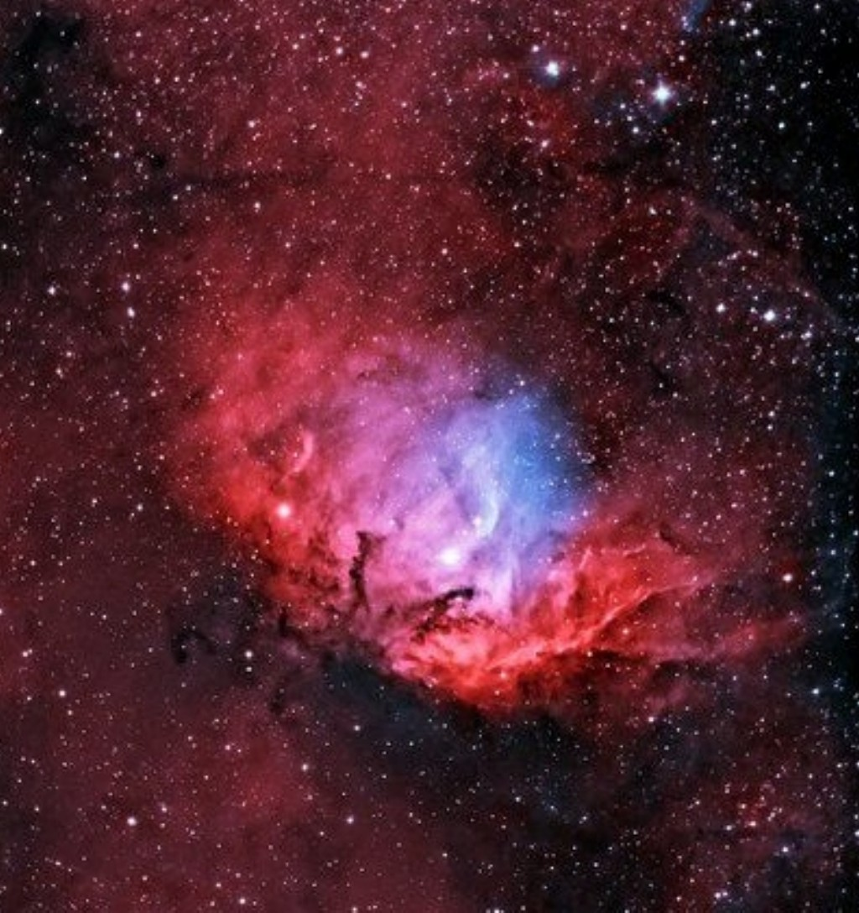

----

En analysant la lumière, on peut déterminer d’autres propriétés des objets lointains comme:

- leur vitesse d’éloignement ou de rapprochement (grâce à l’effet Doppler-Fizeau). C’est le décalage vers le rouge (“red shift”) qui a permis de trouver que l’Univers est en expansion
- leur vitesse de rotation
- leur champ magnétique
- leur masse et leur densité.

---

La mesure de la vitesse de la lumière

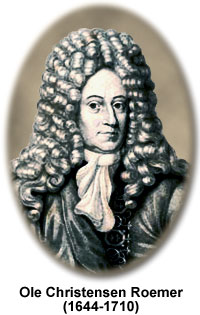

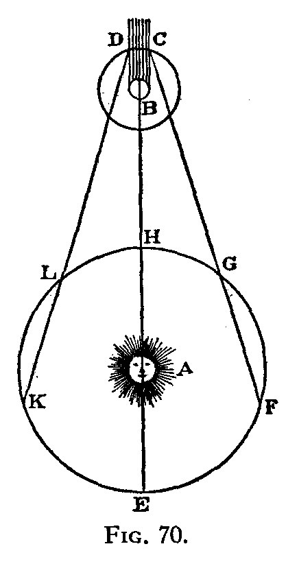

---

Hippolyte Fizeau

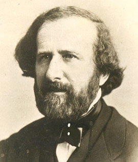

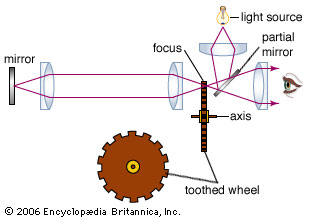

---

Une autre méthode

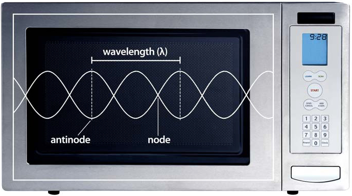

c =  λf

---

## L'éther

Les théories du XIX^e^ siècle supposaient que, comme les vagues sur l'eau ou le son dans l'air, les ondes de la lumière avaient besoin d'un **milieu** pour se déplacer. D'après cette hypothèse,

La Terre se déplace à environ 30km/s, donc 0,01% de la vitesse de la lumière.

Si l'éther existait, on devrait donc pouvoir détecter une différence de vitesse de la lumière dans deux directions à angle droit.

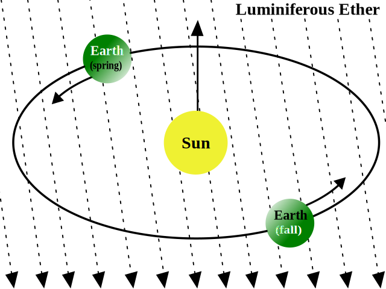

---

Les expériences de Michelson et Morley utilisaient un miroir semi-réfléchissant pour séparer et recombiner deux rayons ayant accompli des parcours à angle droit.

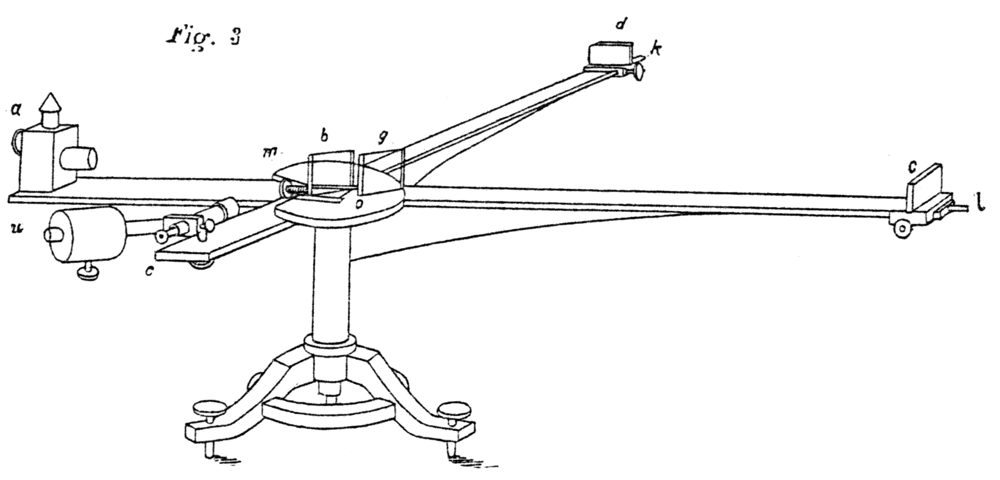

Ces expériences ont eu un résultat négatif, c'est-à-dire qu'elles n'ont pas permis de mesurer une différence de vitesse. On sait maintenant que la lumière a une vitesse constante.

 et on a pu dire qu'elles ont été les plus célèbres expériences ratées, puisqu'elles ont permis à Einstein de concevoir la théorie de la relativité.

D'autre part, un instrument construit sur le même principe est à l'origine de la détection des ondes gravitationnelles.

---

## La Gravité

Les objets ne se comportent pas de la même façon selon qu’ils sont sur Terre (ou une autre planète) ou dans l’espace intersidéral: sur Terre, les choses **tombent** parce que la **gravité** y est plus forte. Cette force agit partout, mais son action se réduit rapidement avec l’éloignement.\
Sur certains corps célestes, elle est beaucoup plus forte que sur Terre.

Pendant la plus grande partie de notre histoire, elle apparaissait comme une évidence, et n’était ni étudiée ni comprise.\
C’est au XVII^e^ siècle que Robert Hooke et Isaac Newton se sont mis à l’étudier en utilisant les mathématiques.

----

## Masse et gravité

- La masse nous indique comment un objet résiste à une force appliquée. Un objet plus massif est plus difficile à déplacer.
- Elle peut aussi être sentie grâce à la gravité: Tout ce qui a une masse génère aussi de la gravité, qui agit sur les autres objets.

- La force subie entre deux objets dépend de 3 choses: les masses des deux objets, et leur distance.
- La gravité s’affaiblit avec le carré de la distance: si la distance double, la force est divisée par 4.
- Si on laisse tomber une pierre, elle accélère: plus la force agit longtemps, plus la vitesse augmente.

Sur Terre, d’autres forces agissent, et perturbent l’accélération dûe à la gravité, mais dans l’espace, la gravité est souvent prépondérante.

---

## Microgravité

La gravité agit partout, et par exemple dans l’ISS en orbite à 200km elle est encore de 90% de celle à la surface. Les astronautes ne sentent pas la gravité parce qu’ils tombent en même temps que leur vaisseau.
Ceci nous fait comprendre la différence entre la **masse** et le **poids**. En orbite on a la même masse, mais on ne sent plus son poids.

Les photons n’ont pas de masse, mais sont affectés par la gravité d’un objet massif. C’est Albert Einstein qui a expliqué que la gravité **courbe** l’espace.

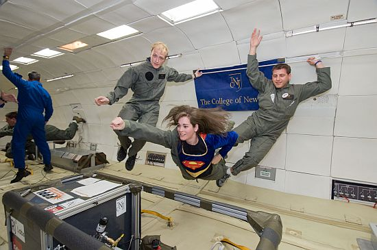

----

## Effondrement gravitationnel

Un nuage de gaz d'une densité suffisante **s'effondre sur lui-même** sous l'effet de sa propre gravité, en s'échauffant, ce qui est la source d'énergie initiale pour démarrer la fusion dans le noyau d'une étoile.

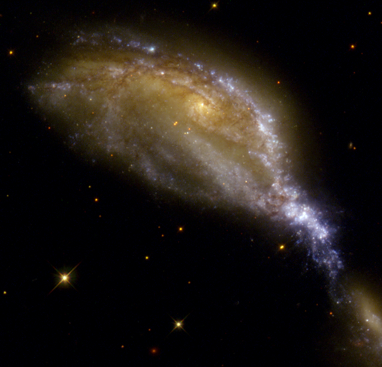

---

## Kepler: 1571-1630

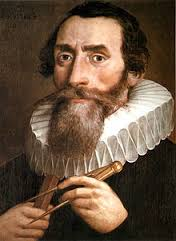

Cette vitesse est de 11km/S pour la Terre, de 58km/S pour Jupiter, et de 600km/S pour le Soleil. \
Plus il s’éloigne, plus l’objet ralentit, mais il ne s’arrête jamais.

L’inverse est aussi vrai: un objet très lointain avec une vitesse nulle tombe sur le corps massif. Au-dessus de la vitesse de libération, l’orbite est parabolique ou hyperbolique (encore plus ouverte).
Loi 1: Les orbites sont des ellipses dont le Soleil occupe un des foyers
Loi 2: Le rayon vecteur balaye des aires proportionnelles au temps.
Loi 3: Les carrés des périodes de révolution sont proportionnels aux cubes des grands axes.

Neptune: 30 AU

---

## Newton: 1643-1727

Quand des objets sont libres de se déplacer sous l’effet de la gravité, on dit qu’ils sont en **orbite**.
Deux objets qui ont une masse s’attirent. S’il n’y a pas d’autres forces, ils se rapprochent, et les mouvements respectifs dépendent de leurs masses: l’objet le plus massif bougera moins que l’autre. \

L’orbite la plus simple est la ligne droite que décrit une pierre qui tombe. On obtient une orbite plus intéressante si on lance la pierre: elle tombe plus loin... et si on la lance très très fort? \
C’est sur cette question que Newton a fait preuve de son génie: il s’est rendu compte que si on la lance avec une vitesse suffisante, la courbe de sa trajectoire sera la même que la courbure de la Terre. Un satellite ne fait rien d’autre que de tomber assez vite pour  éviter la Terre.

F = M x a

---

## Mécanique céleste

<section>
  <pre><code>
Stone.prototype.move = function()
{
  // compute current acceleration
  var r = this.pos.length;
  var gamma =  k / (r * r);

  // acceleration points to center
  var vec = this.pos.normalize();  
  this.v = this.v.subtract(vec.multiply(gamma));

 // update position of satellite
  this.pos = this.pos.add(this.v);
  this.spot.position = view.center.add(this.pos);
  this.pth.add (new Point(this.spot.position));
}

  </code></pre>
</section>

<iframe src="../diagrams/orbit_js.html" height="500" width="500"></iframe>

---

## La situation à la fin du XIX^e^ siècle

- Relativité galiléenne (newtonienne): les lois de la physique sont identiques pour tout observateur se déplaçant à vitesse uniforme

- Electromagnétisme et équations de Maxwell

---

## Einstein: 1879-1955

C'est Einstein qui, par ses deux théories de la relativité, a résolu le problème, en bouleversant la physique:

- la masse et le temps varient avec la vitesse
- la gravité courbe l'espace
- il doit exister des ondes gravitationnelles

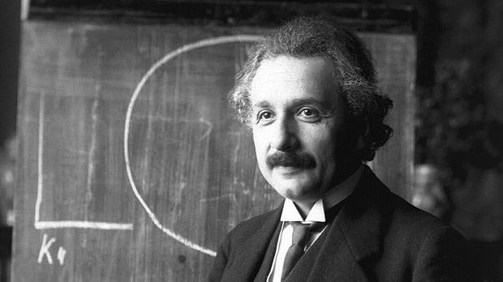

---

## Lentilles gravitationnelles

---

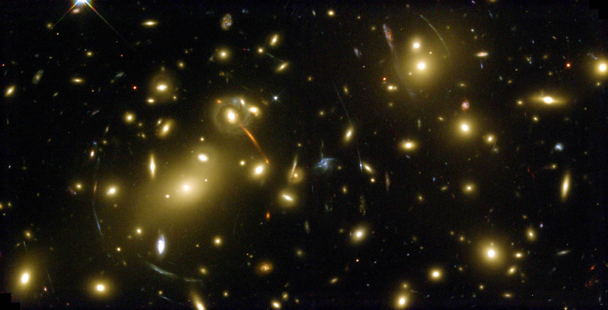

---

## Ondes gravitationnelles

LIGO est un ensemble d'interféromètres destiné à détecter les ondes gravitationnelles.

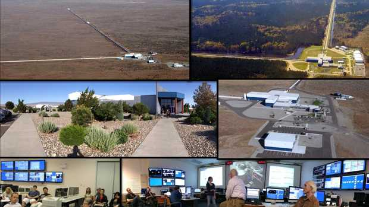

---

La détection du 14 septembre 2015

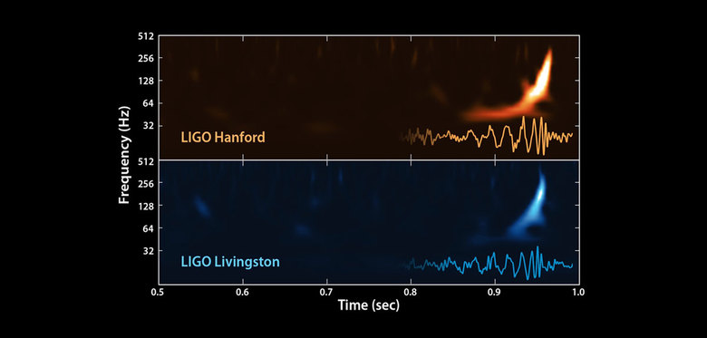

---

##Résumé
Nous avons décrit les diverses formes de rayonnement électromagnétique, la longueur d'onde et la fréquence, les deux modes principaux d'émission de lumière, le décalage vers le rouge, et nous avons évoqué la théorie de l'éther, maintenant abandonnée, puis nous avons décrit l'action de la gravité, les orbites, la microgravité et l'effondrement gravitationnel, et enfin l'expérience LIGO de détection des ondes gravitationnelles.

---

##Références

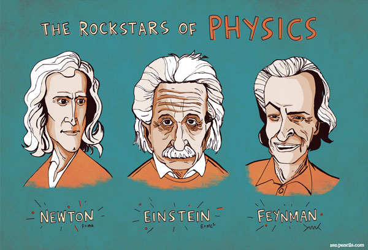

- Isaac Newton - Principia Mathematica
- The collected papers of Albert Einstein
- Cours de physique de Richard Feynman

